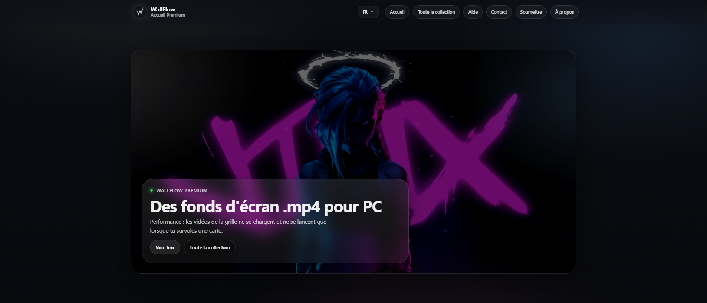

# WallFlow

**La référence des fonds d'écran animés en 4K pour PC.**

Site web statique qui présente une collection de wallpapers vidéo (.mp4) en haute qualité, téléchargeables gratuitement et compatibles avec [Lively Wallpaper](https://apps.microsoft.com/detail/9ntm2qc6qws7) sur Windows.



## Fonctionnalités

- **Collection** : galerie de fonds d'écran animés avec aperçu vidéo, tags et filtre par recherche
- **Page détail** : prévisualisation et téléchargement direct du fichier .mp4
- **Multilingue** : français (langue d'origine), anglais, espagnol
- **Responsive** : menu burger et grille adaptée sur mobile
- **Soumission** : formulaire pour proposer de nouveaux wallpapers
- **À propos** : présentation du créateur (Nyvhan) et liens réseaux

## Stack

- HTML5, CSS3 (sans framework), JavaScript vanilla
- Hébergement : **GitHub Pages**
- Pas de build : fichiers statiques uniquement

## Structure du projet

```
WallFlow/
├── index.html          # Accueil
├── collection.html     # Toute la collection
├── wallpaper.html      # Page détail d’un wallpaper (src, title, file en query)
├── aide.html           # Guide Lively Wallpaper
├── contact.html        # Contact
├── submit.html         # Soumettre un wallpaper
├── creator.html        # À propos
├── 404.html            # Page introuvable
├── lang.js             # i18n (FR/EN/ES)
├── preview.png         # Image de prévisualisation (og:image, Twitter)
├── icons/              # Logo WallFlow, réseaux (Discord, Steam, etc.)
├── wallpapers/         # Dossier des vidéos .mp4
├── createur/           # Bannière et photo de profil (À propos)
└── README.md
```

## Déploiement sur GitHub Pages

1. Pousse le dépôt sur GitHub
2. **Settings** → **Pages** → **Source** : *Deploy from a branch*
3. Branch : `main` (ou `master`), dossier : `/ (root)`
4. Sauvegarde : le site sera disponible à `https://<username>.github.io/<repo>/`

Tous les liens du site sont **relatifs** (`index.html`, `icons/`, `wallpapers/`, etc.), en minuscules et sans espaces, pour une compatibilité optimale avec GitHub Pages.

## Licence

© 2026 WallFlow • Contenu et visuels sous droits réservés. Pour toute demande de retrait : voir [Contact](contact.html).
